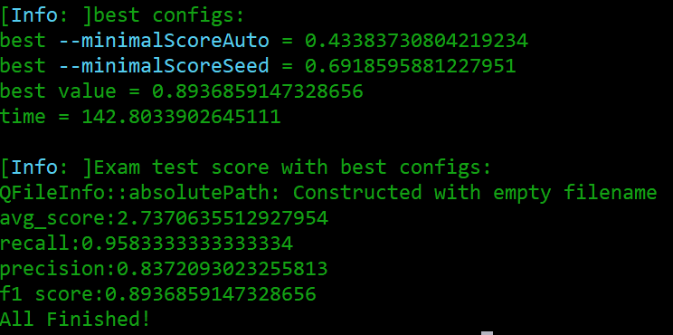

## Automatical parameters optimization
As we have developed four different metrics, the reconstruction result could be evaluated quantitatively.
To search for the best parameters automatically for tracing methods with tunable algorithms, 
we integrate these metrics into a optimize procedure. 
Simulated Annealing is used to find the global optimal result, and the loss value in each iteration is the F1 score of the precision and recall in output. 

### 1. Input

#### 1.1 Command line: 

Similar to metric methods in PyNeval, gold standard swc file, test tiff to be reconstructed and metric method should be 
provided in command line. Besides, the path of optimization config file is required via argument: --optimize. 

    pyneval [-h] [--gold GOLD_PATH] [--test [TEST_PATH1, TEST_PATH2, ...]] 
            [--metric METRIC] [--optimize OPTIMIZATION_CONFIG_PATH] 

|meaning|cmd|brief_cmd|required|default|range|
| --- | --- | --- | --- | --- | --- |
| path of a gold standard swc file | --gold | -G | T | - |  |
| path of a tif files waiting to be reconstructed | --test | -T | T | - |  |
| metric method | --metric | -M | T | - | ssd, length, diadem, cn |
| path of optimization config file in json format | --optimize | - | F | default config | - |

#### 1.2 Config file of optimation
Format:

    {
        # arguments about tracing method. 
        "trace": { 
            "cli": basic command line of your tracing methods, locate input and output using {input} and {output},
            "workDir": output directory of the reconstruction with best parameter(s), the name of output file is set to {input}_best.swc
            "parameters": {
                "--tartet_parameter1": {
                    "type": "number", # options: "number", "integer", "boolean".
                    "default": 0.3, # default should be located in range below.
                    "range": [0, 1.0] # the first value should be smaller than the seconed value.
                },
                "--tartet_parameter2": {
                    "type": "number",
                    "default": 0.3, 
                    "range": [0, 1.0]
                },
                ...
                # The number of parameters is arbitrary from 1 to inffinite(if you can write down them all).
                # Finally command line will look like below:
                # cli --tartet_parameter1 --tartet_parameter2
            }
        },
        "optimize": {
            # optimization parameters of simulated annealing
            "SA": {
                "Tmax": 0.01, # initial temperature
                "Tmin": 1e-5, # minimum temperature
                "q": 0.96, # cool down rate
                "L": 25, # iteraions in each temperature
                "maxStayCounter": 15 # if current best result stay unchanged after maxStayCounter times of cool down, program will be stopped. 
            }
        }
    }

Example:

    {
        "trace": {
            "cli": "packneutu --trace {input} --output {output}",
            "workDir": "./data/optimation/output/",
            "parameters": {
                "--minimalScoreAuto": {
                    "type": "number",
                    "default": 0.3,
                    "range": [0, 1.0]
                },
                "--minimalScoreSeed": {
                    "type": "number",
                    "default": 0.35,
                    "range": [0, 1.0]
                }
            }
        },
        "optimize": {
            "SA": {
                "Tmax": 0.01,
                "Tmin": 1e-5,
                "q": 0.96,
                "L": 25,
                "maxStayCounter": 15
            }
        }
    }

### 2 OUTPUT
After the optimization of each temperature, the intermediate process will be output.

The final result and an additional check for the best parameter. 

The variation of the optimal value with the number of iterations is provided. It will be automatically saved in workDir. 

